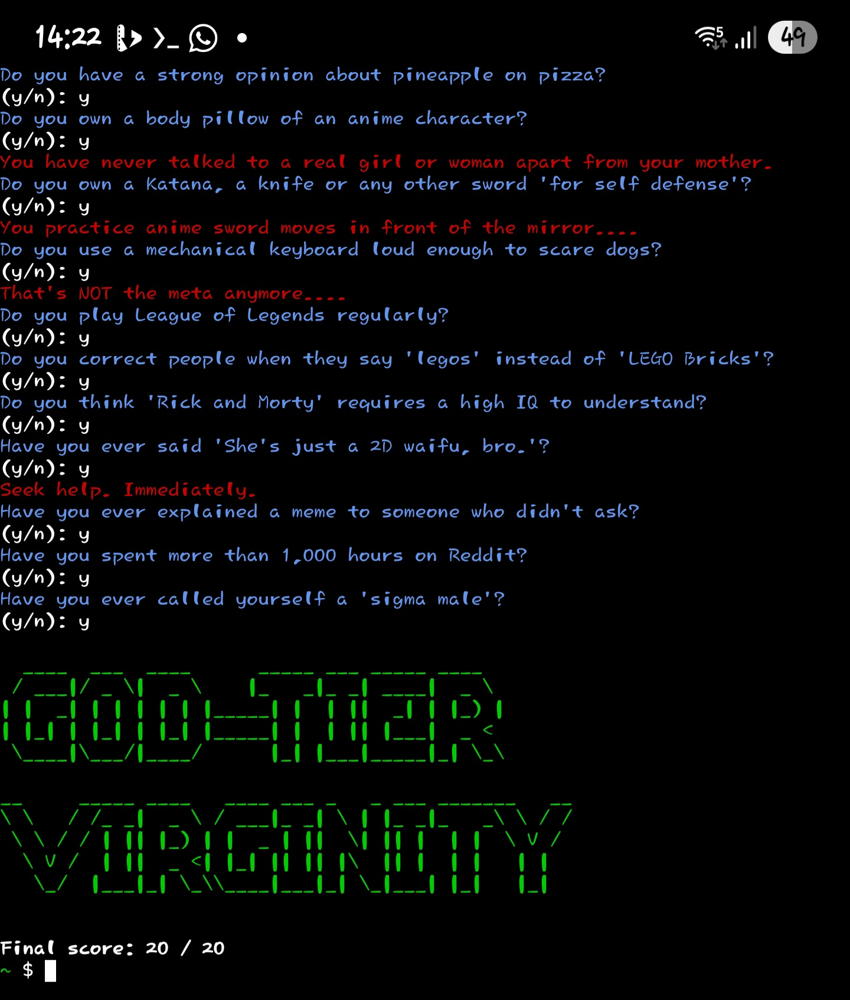

>## v-testME

Virginity Assessment Test™ - Male Edition

A terminal based meme quiz that asks
absurdly specific questions and roasts
you based on your answers.

Not scientifically accurate. 100% judgemental.

## Note
I shall provide 3 install scripts. One for Linux, one for Termux and one for Windows. I currently only have a phone, so I can only guarantee the Termux script will work, as I don't have what to test other scripts on, that is, a PC. Please provide feedback so I can fix the install scripts if they don't work. For now, they are just guesswork.

Otherwise, the v-testME Python file is guaranteed to work. And if an install script doesn't work, you can manually install this program. Check `Manual Program Installation`.

> ## Manual Program Installation
> If you want to install this manually, here's how. Note that am only providing an install guide for Termux and Linux, as it's very similar. Termux is basically Linux in a box.
>
> First, you wanna download the Python file. The one called 'v-testME'.
> Here: 
> Then, you wanna give it the execution permission.
> Like this: `chmod +x v-testME`
> Now, you might want to make it look like a CLI command more, by renaming the 'ME' part with 'me'.
> Once that's done, move it to the /bin folder or wherever necessary. Now you can execute it as a command system-wide by typing `v-testME`, or whatever you named it before placing it in /bin.
>
> PS: I only provided instructions for Linux/Termux as I am not familiar with Windows that much, and don't have a Windows PC to test on. Am soon getting a trashy one so you can expect the instructions when I get the PC.

> ## Requirements
> - Colorama
> - Pyfiglet
>
>But don't worry, the install >scripts take care of the >requirements
>automatically.

>This is an open source project, >if it wasn't already obvious.
>If you want to see the code, >just look inside the v-testME >file.
>This is program is written in >Python. ～⁠>⁠`⁠)⁠～⁠～⁠～

This is the Male Edition of v-test.
FE coming soon! I plan to add
up to 256 questions to each test.
From all available questions, the test asks you 20 random ones.
Some questions don't add any points at all to your virginity score. Most add 1.
Some questions might add up to 3, for now.

> ⚠️ **Disclaimer:**  
> This tool is entirely satirical and meant for entertainment purposes only.  
> It is not a real diagnostic tool, and it does not reflect reality, identity, or worth.  
> If you feel called out... maybe that’s just coincidence. 😏  
>  
> Use responsibly.
